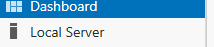
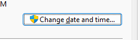
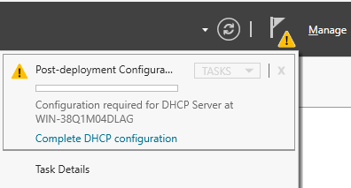
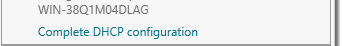
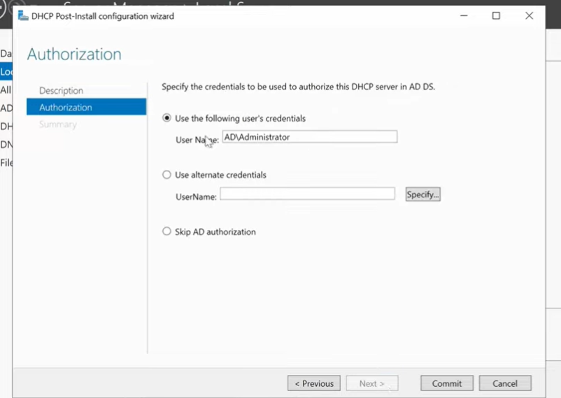
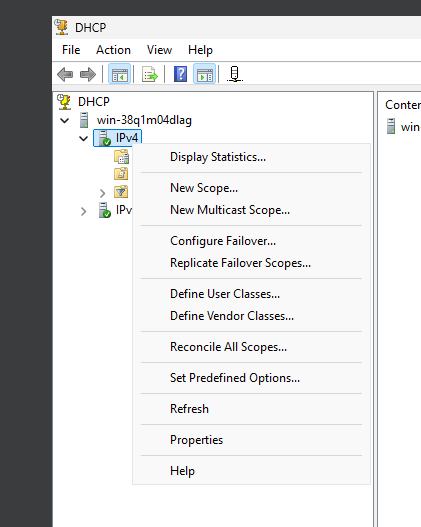
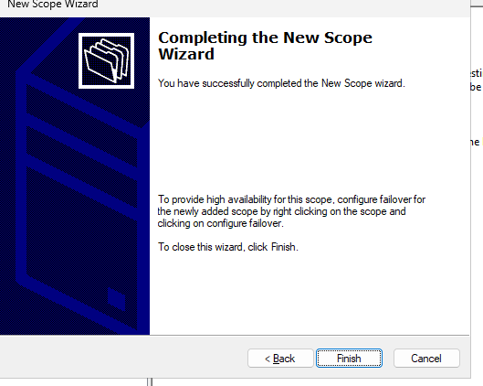
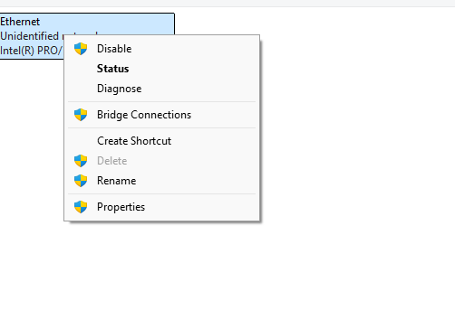
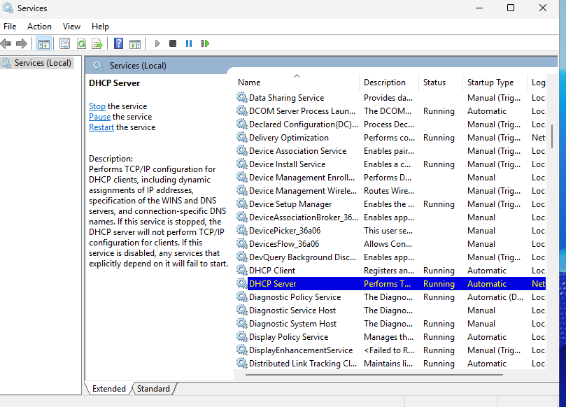
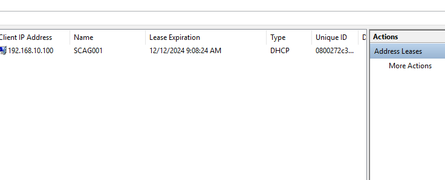

## After Installation Configurations

### Static IP Configuration
**Hinweis:** Diese Konfiguration muss nicht wiederholt werden, wenn sie bereits abgeschlossen ist.

### Zeitzonenkonfiguration
Gehen Sie im Hauptmenü wie folgt vor:

1. Klicken Sie auf das Symbol **Local Server**.
   
2. Scrollen Sie horizontal in den **Server Properties**, bis Sie die Einstellung für die **Time Zone** sehen.
   

   Es sollte so aussehen, wenn Sie die Zeitzoneneinstellung gefunden haben:
   

3. Klicken Sie auf den **Text der Time Zone**, um die Einstellung zu ändern.
   
4. Wählen Sie **Change Time and Date** aus.
   

Wählen Sie Ihre aktuelle Zeitzone aus.  
**Warum ist dies wichtig?**  
Die korrekte Zeitzone hilft, häufig auftretende Verbindungsprobleme zu vermeiden, die durch Zeitdifferenzen entstehen können.

---

## DHCP Post-Installationskonfiguration

Nach der Installation sehen Sie im Hauptmenü ein gelbes Warnsymbol in der oberen rechten Ecke des Bildschirms:

1. Klicken Sie auf das **Flagge-Symbol** mit dem gelben Dreieck.
   
2. Wählen Sie **Complete DHCP Configuration** aus.
   
3. Ein Konfigurationsfenster wird angezeigt. Lesen Sie die Informationen durch und klicken Sie auf **Commit**.
   

**Hinweis:**  
Wenn der Server ohne Active Directory (AD) installiert wurde, verwendet der DHCP-Server das aktuelle Administratorkonto.  
Falls AD installiert ist, wird das Konto für Benutzerverwaltung notwendig. Dies ist jedoch für den Moment irrelevant.

**Ergebnis:**  
Die Installation und Post-Konfiguration des DHCP-Moduls ist abgeschlossen.

---

## DHCP Ranges Konfiguration

### Theorie
Bevor wir die DHCP-Ranges konfigurieren, behandeln wir kurz die theoretischen Grundlagen.  
Dies ist nicht zwingend erforderlich, hilft jedoch, die Konfiguration besser zu verstehen.

#### **Was sind DHCP-Ranges?**

Die **DHCP-Range** ist der Bereich von IP-Adressen, die ein **DHCP-Server** automatisch an Geräte im Netzwerk vergibt.

##### Kernpunkte:  
1. **Zweck**:  
   DHCP automatisiert die IP-Adressvergabe und reduziert manuelle Konfigurationsfehler.

2. **Definition**:  
   - Die **Range** gibt an, welche IP-Adressen automatisch vergeben werden.  
   - Beispiel: Eine Range von `192.168.1.100` bis `192.168.1.200` bedeutet, dass nur Adressen in diesem Bereich vergeben werden.

3. **Einstellungen**:  
   - Konfiguration erfolgt im Router oder Server.  
   - Außerhalb der Range können **statische IP-Adressen** (z. B. für Drucker oder Server) verwendet werden.

4. **Zusätzliche Parameter**:  
   Neben der IP-Adresse können Subnetzmaske, Gateway und DNS-Server automatisch verteilt werden.

##### Vorteile:  
- Automatisierung der Netzwerkkonfiguration  
- Reduzierung von Fehlern bei der manuellen IP-Vergabe

---

### IP Ranges festlegen
Vor der Konfiguration der Ranges ist es wichtig, den Unterschied zwischen **IPv4** und **IPv6** zu verstehen.

#### **Erklärung zu IPv4 und IPv6**

**IPv4** und **IPv6** sind Protokolle zur Adressierung von Geräten in Netzwerken. Sie stellen sicher, dass Datenpakete an die richtigen Geräte gesendet werden.

##### IPv4 (Internet Protocol Version 4)  
1. **Adressformat**:  
   - 32-Bit-Adressen, dargestellt als vier Zahlen (0-255), getrennt durch Punkte.  
   - Beispiel: `192.168.1.1`

2. **Kapazität**:  
   - Bis zu **4,3 Milliarden Adressen** verfügbar.  

3. **Merkmale**:  
   - Einfach einzusetzen und weit verbreitet.  
   - Unterstützt Broadcast.  
   - Keine eingebauten Sicherheitsfunktionen.

##### IPv6 (Internet Protocol Version 6)  
1. **Adressformat**:  
   - 128-Bit-Adressen, dargestellt in Hexadezimalgruppen, getrennt durch Doppelpunkte.  
   - Beispiel: `2001:0db8:85a3:0000:0000:8a2e:0370:7334`

2. **Kapazität**:  
   - Theoretisch **340 Sextillionen Adressen**.

3. **Merkmale**:  
   - Integrierte Sicherheitsfunktionen (z. B. IPsec).  
   - Effizientere Datenweiterleitung.  
   - Unterstützt automatische Adresskonfiguration.

##### Unterschiede zwischen IPv4 und IPv6  

| **Eigenschaft**        | **IPv4**                  | **IPv6**                  |
|------------------------|---------------------------|---------------------------|
| **Adresslänge**        | 32 Bit                   | 128 Bit                  |
| **Adressformat**       | Dezimal (z. B. 192.0.2.1) | Hexadezimal (z. B. 2001:db8::1) |
| **Adressanzahl**       | 4,3 Milliarden           | 340 Sextillionen         |
| **Sicherheit**         | Extern (z. B. Firewalls) | Integriert (IPsec)       |
| **Kompatibilität**     | Veraltet, aber weit verbreitet | Modern, noch im Aufbau   |

##### Zusammenfassung  
- **IPv4** ist bewährt und weit verbreitet, aber aufgrund der begrenzten Adressanzahl zunehmend problematisch.  
- **IPv6** ist moderner, zukunftssicher und leistungsfähiger, wird jedoch noch nicht flächendeckend eingesetzt.

# After Installation Configurations

## Static IP Configuration
**Hinweis:** Diese Konfiguration muss nur einmal durchgeführt werden.

### Zeitzonen-Konfiguration
Um die Zeitzone einzustellen, folgen Sie diesen Schritten:

1. Öffnen Sie das **Main Menu** und klicken Sie auf das **Local Server**-Symbol.  
   

2. Scrollen Sie horizontal durch die **Server Properties**, bis Sie die Einstellung **Time Zone** finden.  
   

   So sieht es aus, wenn die Einstellung sichtbar ist:  
   

3. Klicken Sie auf den angezeigten Zeitzonentext, um Änderungen vorzunehmen.  
   

4. Klicken Sie auf **Change Time and Date**.  
   

5. Wählen Sie Ihre aktuelle Zeitzone aus.  

**Wichtig:** Die richtige Zeitzoneneinstellung hilft, Verbindungsprobleme durch inkorrekte Zeitstempel zu vermeiden.

---

## DHCP Post-Install Configuration

Nach der Installation sehen Sie im **Main Menu** oben rechts ein gelbes Warnsymbol.  

### Schritte:
1. Klicken Sie auf das Symbol mit der gelben Flagge.  
   

2. Wählen Sie **Complete DHCP Configuration** aus.  
   

3. Ein Konfigurationsassistent öffnet sich. Lesen Sie die Informationen durch und klicken Sie anschließend auf **Commit**.  
   

**Hinweis:**  
- Falls kein Active Directory (AD) installiert ist, verwendet der DHCP-Server das aktuelle Administratorkonto.  
- Bei Servern mit AD wird die AD-Benutzerkonfiguration verwendet.  
  

Nachdem diese Schritte abgeschlossen sind, ist die Installation und grundlegende Konfiguration des DHCP-Servers abgeschlossen.

---

## DHCP Ranges Configuration

### Theorie: Was ist eine DHCP-Range?
Eine **DHCP-Range** definiert den Bereich von IP-Adressen, die ein DHCP-Server automatisch an Geräte im Netzwerk vergibt.  

#### Vorteile von DHCP:
- **Automatische IP-Zuweisung:** Erleichtert die Netzwerkkonfiguration.  
- **Effizienz:** Minimiert Fehler und beschleunigt den Prozess.

Beispiel einer Range:  
`192.168.1.100` – `192.168.1.200`  

#### Zusätzliche Parameter:
- Subnetzmaske
- Gateway
- DNS-Server

---

### Unterschiede: IPv4 vs. IPv6

| **Eigenschaft**        | **IPv4**                  | **IPv6**                  |
|------------------------|---------------------------|---------------------------|
| **Adresslänge**        | 32 Bit                   | 128 Bit                  |
| **Adressformat**       | Dezimal (z. B. 192.0.2.1) | Hexadezimal (z. B. 2001:db8::1) |
| **Kapazität**          | 4,3 Milliarden           | 340 Sextillionen         |
| **Sicherheit**         | Extern (z. B. Firewalls) | Integriert (IPsec)       |

IPv4 ist aktuell noch weit verbreitet, jedoch limitiert in der Kapazität. IPv6 ist die moderne Lösung, aber nicht überall etabliert.

---

### Schritte zur DHCP-Range-Konfiguration

1. Öffnen Sie das **Tools-Menü**.  
   

2. Wählen Sie **DHCP**.  
     
   

3. Klicken Sie im linken Menü auf den gewünschten Server.  
   

4. Navigieren Sie zum **IPv4**-Abschnitt und klicken Sie mit der rechten Maustaste darauf.  
   

5. Wählen Sie **New Scope**.  
   

6. Ein Assistent wird geöffnet. Füllen Sie die Felder wie folgt aus:  
   - **Name des Scopes:** Wählen Sie einen eindeutigen Namen.  
     

   - **IP-Range:** Definieren Sie Start- und Endadresse basierend auf Ihrem IP-Plan.  
     

7. **Exclusions and Delays:** Konfigurieren Sie Ausschlüsse für statische IP-Adressen.  
   - Beispiel: Reservierte Adressen für Server oder Drucker.  
     

8. **Lease-Dauer:** Wählen Sie die Standardwerte aus.  
   

9. **Default Gateway:** Geben Sie die Gateway-IP ein (z. B. `10.0.0.254`).  
   

10. **Weitere Konfigurationen:**  
    - DNS-Server: Falls nicht vorhanden, überspringen.  
    - WINS-Server: Überspringen.  
      
    

11. Fertigstellen des Assistenten.  
    

12. Starten Sie den DHCP-Server neu:  
    - Rechte Maustaste auf den Server → **All Tasks → Restart**.  
      

Nach dem Neustart können Sie den Server über den DHCP-Manager verwalten.  

---

## Client Configuration

Stellen Sie sicher, dass der Client so konfiguriert ist, dass er eine IP-Adresse automatisch per DHCP bezieht:

1. Öffnen Sie die **Systemsteuerung** und navigieren Sie zu **Netzwerk und Internet → Netzwerk- und Freigabecenter**.  
   

2. Klicken Sie auf **Adaptereinstellungen ändern**.  
   

3. Wählen Sie Ihren Netzwerkadapter und öffnen Sie die **Eigenschaften**.  
   

4. Markieren Sie **Internetprotokoll Version 4 (TCP/IPv4)** und klicken Sie auf **Eigenschaften**.  
   

5. Stellen Sie sicher, dass **IP-Adresse automatisch beziehen** und **DNS-Serveradresse automatisch beziehen** aktiviert sind.  
   

6. Bestätigen Sie mit **OK**.

---

## Testen der Konfiguration

### Serverseitig:
1. Stellen Sie sicher, dass der DHCP-Dienst läuft (`services.msc`).  
   

2. Überprüfen Sie im DHCP-Manager, ob der Client eine Lease erhalten hat.  
   

### Clientseitig:
1. Führen Sie `ipconfig /renew` in der Eingabeaufforderung aus.  
   

2. Überprüfen Sie die erhaltene IP-Adresse mit `ipconfig`.  
   

---

**Hinweis:** Weitere Schritte wie Fehlerbehebung und Feinabstimmung können erforderlich sein, um die Konnektivität zu optimieren.
