## After Installation Configurations

### Static IP Configuration
**Wichtig:** Diese Konfiguration ist bereits abgeschlossen und muss nicht erneut durchgeführt werden.

---

### Time Zone Configuration
1. Öffnen Sie im Hauptmenü das **Local Server Icon**.
   

2. Scrollen Sie horizontal in den Server-Eigenschaften, bis Sie die Einstellung **Time Zone** finden.
   

   **Ansicht der Time Zone Einstellung:**
   

3. Klicken Sie auf den Text der **Time Zone**, um Änderungen vorzunehmen.
   

4. Wählen Sie **Change Time and Date** aus.
   

5. Wählen Sie Ihre aktuelle Zeitzone aus.

   **Hinweis:** Die korrekte Zeitzoneneinstellung ist entscheidend, um Probleme bei der Synchronisation und Verbindung aufgrund falscher Zeitkonfiguration zu vermeiden.

---

## DHCP Post-Installation Configuration

Nach der Installation sehen Sie im Hauptmenü oben rechts ein gelbes Warnsymbol.

1. Klicken Sie auf das **Flaggensymbol** mit dem gelben Dreieck.
   

2. Wählen Sie **Complete DHCP Configuration** aus.
   

3. Ein Fenster mit Erläuterungen wird angezeigt. Lesen Sie die Hinweise und klicken Sie anschließend auf **Commit**.
   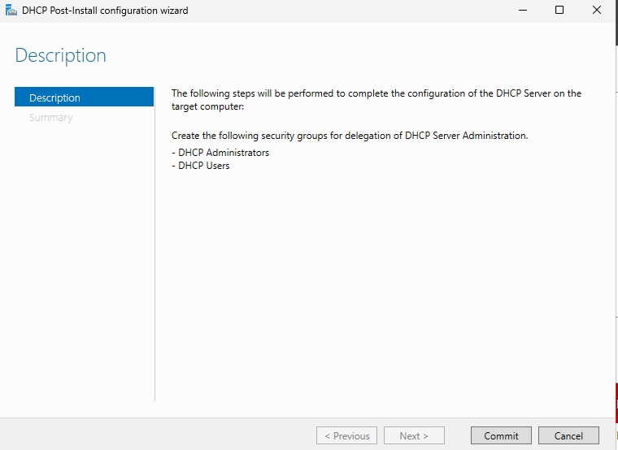

   **Zusätzliche Information:**  
   - Wenn der Server ohne Active Directory (AD) installiert wurde, verwendet der DHCP-Server das aktuelle Administratorkonto.  
   - Bei einem Server mit AD sieht die Konfiguration anders aus, da Benutzerkonten aus der AD erforderlich sind:  
       

   Diese Konfiguration wird relevant, wenn Sie später intensiver mit Windows Server und Active Directory arbeiten. Für den Moment können wir diesen Punkt ignorieren.

**Abschluss:** Die Installation und Post-Installation-Konfiguration des DHCP-Moduls ist nun abgeschlossen.

---

## DHCP Ranges
### Konfiguration des DHCP-Servers

#### Theorie
Bevor wir mit der Konfiguration der DHCP-Ranges beginnen, sollten wir einige Grundlagen verstehen. Dies ist nicht zwingend erforderlich, hilft jedoch, ein besseres Verständnis für die Funktionalität zu entwickeln.

---

#### **Was sind DHCP-Ranges?**
Die **DHCP-Range** ist der Bereich von IP-Adressen, die ein **DHCP-Server** (Dynamic Host Configuration Protocol) automatisch an Geräte in einem Netzwerk vergibt.

##### Kernpunkte:
1. **Zweck:**  
   DHCP automatisiert die Zuweisung von IP-Adressen und reduziert den Aufwand für manuelle Konfigurationen.

2. **Range-Definition:**  
   - Die Range legt fest, welche IP-Adressen zur automatischen Vergabe verfügbar sind.  
   - Beispiel: Eine Range von `192.168.1.100` bis `192.168.1.200` bedeutet, dass nur diese Adressen vom DHCP-Server vergeben werden.

3. **Einstellungen:**  
   - Konfiguration erfolgt auf dem Router oder Server.  
   - Adressen außerhalb der Range werden für statische IPs verwendet (z. B. für Drucker oder Server).

4. **Zusätzliche Parameter:**  
   Neben IP-Adressen können DHCP-Server auch Subnetzmaske, Gateway und DNS-Server verteilen.

##### Vorteile:
- Automatisierung der Netzwerkkonfiguration.  
- Minimierung von Fehlern bei der manuellen Eingabe.

---
## **Die IP-Ranges konfigurieren**

Um die IP-Ranges korrekt zu konfigurieren, benötigen wir zunächst ein grundlegendes Verständnis von Netzwerktechnologien. Dazu gehören insbesondere die Unterschiede zwischen **IPv4** und **IPv6**.

---

### **Erklärung zu IPv4 und IPv6**  

**IPv4** und **IPv6** sind Protokolle, die zur Adressierung von Geräten in einem Netzwerk wie Computern, Smartphones oder Servern verwendet werden. Sie sorgen dafür, dass Datenpakete an die richtigen Ziele gesendet werden.

---

#### **IPv4 (Internet Protocol Version 4)**  

1. **Adressformat**:  
   - IPv4-Adressen bestehen aus **32 Bit** und werden als vier Zahlen (0–255), getrennt durch Punkte, dargestellt.  
   - Beispiel: `192.168.1.1`.

2. **Kapazität**:  
   - Unterstützt maximal **4,3 Milliarden Adressen**.  
   - Aufgrund der begrenzten Adressanzahl wird IPv4 immer knapper.

3. **Merkmale**:  
   - Weit verbreitet und einfach einzusetzen.  
   - Unterstützt Broadcast (Nachrichten an alle Geräte im Netzwerk).  
   - Bietet keine eingebauten Sicherheitsfunktionen wie Verschlüsselung.

---

#### **IPv6 (Internet Protocol Version 6)**  

1. **Adressformat**:  
   - IPv6-Adressen bestehen aus **128 Bit** und werden als acht Gruppen von Hexadezimalzahlen, getrennt durch Doppelpunkte, dargestellt.  
   - Beispiel: `2001:0db8:85a3:0000:0000:8a2e:0370:7334`.

2. **Kapazität**:  
   - Theoretisch **340 Sextillionen Adressen** – genug, um jedes Gerät weltweit zu adressieren.

3. **Merkmale**:  
   - Integrierte Sicherheitsfunktionen wie IPsec für Verschlüsselung.  
   - Effizientere Datenweiterleitung (kein Broadcast, sondern Multicast).  
   - Unterstützt automatische Adresskonfiguration.

---

#### **Unterschiede zwischen IPv4 und IPv6**  

| **Eigenschaft**        | **IPv4**                  | **IPv6**                  |
|------------------------|---------------------------|---------------------------|
| **Adresslänge**        | 32 Bit                   | 128 Bit                  |
| **Adressformat**       | Dezimal (z. B. 192.0.2.1) | Hexadezimal (z. B. 2001:db8::1) |
| **Adressanzahl**       | 4,3 Milliarden           | 340 Sextillionen         |
| **Sicherheit**         | Extern (z. B. Firewalls) | Integriert (IPsec)       |
| **Kompatibilität**     | Veraltet, aber weit verbreitet | Modern, noch im Aufbau   |

---

#### **Zusammenfassung**  
- **IPv4** ist das ältere, aktuell weit verbreitete Protokoll, wird jedoch durch die begrenzte Adressanzahl zunehmend problematisch.  
- **IPv6** ist moderner, leistungsfähiger und zukunftssicher, jedoch noch nicht flächendeckend implementiert.

---

### **Erklärung zu statischen IP-Adressen**  

Eine **statische IP-Adresse** ist eine fest zugewiesene Adresse, die einem Gerät im Netzwerk dauerhaft manuell konfiguriert wird. Im Gegensatz zu einer dynamischen IP-Adresse, die von einem DHCP-Server automatisch vergeben wird, bleibt eine statische IP unverändert.

---

#### **Eigenschaften einer statischen IP**  

1. **Dauerhaftigkeit**:  
   - Die Adresse bleibt gleich, auch nach einem Neustart des Geräts oder Routers.  
   - Beispiel: Ein Server hat dauerhaft die IP-Adresse `192.168.1.10`.

2. **Manuelle Konfiguration**:  
   - Die Zuweisung erfolgt durch einen Administrator direkt am Gerät oder im Router.

3. **Individuelle Einstellungen**:  
   - Neben der IP-Adresse müssen Subnetzmaske, Gateway und DNS-Server manuell konfiguriert werden.

---

#### **Vorteile statischer IPs**  

1. **Einfacher Zugriff auf Geräte**:  
   - Ideal für Server, Drucker oder Überwachungskameras, die leicht erreichbar sein müssen.  
   - Beispiel: Ein Webserver ist über eine feste IP erreichbar, was für Domains und Remote-Zugriffe wichtig ist.

2. **Stabilität**:  
   - Verhindert Probleme bei Diensten, die eine feste IP benötigen (z. B. Portweiterleitungen, VPNs).

3. **Erleichtertes Netzwerkmanagement**:  
   - Unterstützt die Fehlersuche und Überwachung im Netzwerk.

---

#### **Nachteile statischer IPs**  

1. **Aufwändige Verwaltung**:  
   - Jede Änderung erfordert manuelle Anpassungen, was in großen Netzwerken zeitintensiv ist.

2. **Fehleranfälligkeit**:  
   - Falsche Konfigurationen können zu IP-Konflikten führen (z. B. doppelte IP-Adressen).

3. **Sicherheitsrisiken**:  
   - Statische IPs sind anfälliger für Angriffe, da ihre Adressen leicht vorhersehbar sind.

---

#### **Einsatzgebiete statischer IPs**  

1. **Server**: Web-, Mail- und Datenbankserver benötigen feste Adressen für konstante Erreichbarkeit.  
2. **Netzwerkgeräte**: Drucker, NAS und andere Geräte in lokalen Netzwerken, die von mehreren Nutzern verwendet werden.  
3. **Fernzugriff**: Für Geräte, die über das Internet oder ein VPN erreichbar sein müssen.  
4. **IoT-Geräte**: Smarte Geräte, die spezielle Netzwerkeinstellungen benötigen.

---

#### **Zusammenfassung**  
Statische IP-Adressen sind ideal für Geräte, die stabil und konsistent erreichbar sein müssen. Sie bieten Vorteile wie Stabilität und bessere Netzwerkverwaltung, erfordern jedoch mehr Verwaltungsaufwand und bergen potenzielle Sicherheitsrisiken. Sie sind nicht für jedes Gerät notwendig, aber in bestimmten Szenarien unverzichtbar.

---

---

### Configuration

Hier werden wir die Ranges im IPv4-Format manuell auswählen und anschließend aktualisieren.

#### Menüs

Um in das Konfigurationsmenü zu gelangen, führen wir folgende Schritte auf dem Server aus:

1. **Öffnen Sie die Tools**  
   In der oberen rechten Ecke klicken wir auf **Tools**:  
   

2. **Wählen Sie DHCP aus**  
   Unter den Tools klicken wir auf **DHCP**:  
   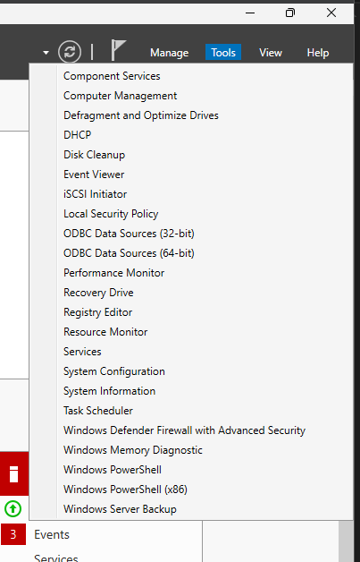  
   

Nun befinden wir uns erfolgreich im Konfigurationsmenü. Es sollte folgendermaßen aussehen:  
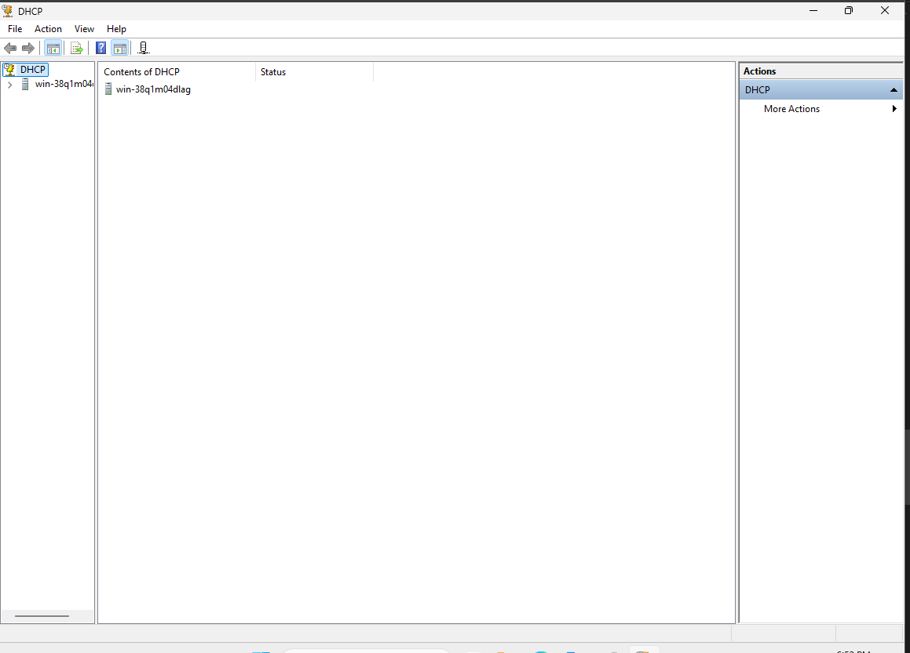

3. **Wählen Sie den gewünschten Server aus**  
   Im Menü auf der linken Seite klicken wir auf den Server, den wir konfigurieren möchten.  
   In unserem Fall wählen wir den ersten Server aus:  
   

4. **Öffnen Sie den IPv4-Bereich des DHCP-Servers**  
   Klicken Sie auf den Abschnitt **IPv4**:  
   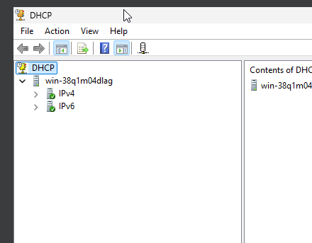

5. **Erstellen Sie einen neuen Bereich**  
   Klicken Sie mit der rechten Maustaste auf das **IPv4-Symbol** und wählen Sie **New Scope**:  
     
   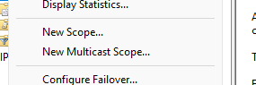

Ein Assistent führt Sie durch die weiteren Schritte zur Konfiguration des Bereichs.

---

#### Bereiche konfigurieren

1. **Namen für den Bereich festlegen**  
   Geben Sie dem Bereich einen eindeutigen Namen, der eine klare Identifikation ermöglicht:  
   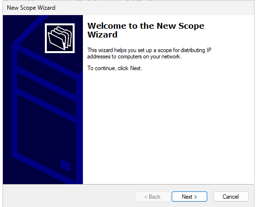

   Schauen Sie in Ihren IP-Plan, um eine passende Range für den Server auszuwählen. Ziel ist es, das Netzwerk effizient aufzuteilen, sodass:
   - Alle Geräte einen Platz im Netzwerk haben,
   - Es keine Konflikte bei der IP-Adressvergabe gibt und
   - Platz für zukünftige Erweiterungen bleibt.

2. **IP-Bereiche festlegen**  
   Nutzen Sie den IP-Plan, um die IP-Bereiche in den Scope einzutragen, und klicken Sie auf **Next**:  
   

3. **Statische IP-Adressen konfigurieren**  
   Geben Sie die IP-Range ein und klicken Sie auf **Add**. Anschließend fahren Sie mit **Next** fort:  
   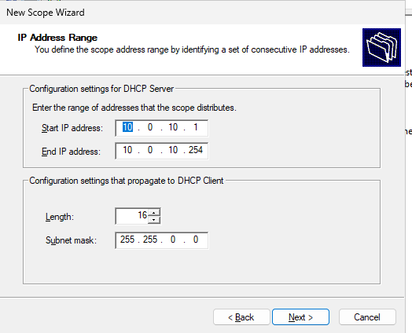

4. **Lease-Dauer festlegen**  
   Definieren Sie die Lease-Dauer, also die Zeit, wie lange eine IP-Adresse für ein Gerät reserviert bleibt. Wählen Sie den Standardwert und klicken Sie auf **Next**:  
   

5. **Standard-Gateway hinzufügen**  
   Geben Sie das Standard-Gateway ein. In unserem Fall: `10.0.0.254`. Klicken Sie auf **Next**:  
   

6. **DNS-Server-Konfiguration überspringen**  
   Wenn Sie keinen DNS-Server konfigurieren möchten, klicken Sie auf **Next**:  
   

7. **WINS-Server-Konfiguration überspringen**  
   Auch hier können Sie **Next** klicken:  
   

8. **Abschluss des Assistenten**  
   Überprüfen Sie die Konfiguration und klicken Sie auf **Finish**:  
   

---

#### Neustart des DHCP-Servers

1. Klicken Sie mit der rechten Maustaste auf den Haupt-DHCP-Server, wählen Sie **All Tasks** und anschließend **Restart**:  
   

2. Warten Sie, bis der Neustart abgeschlossen ist:  
   

Nach der erfolgreichen Konfiguration sollten die Einstellungen in den Dateien angezeigt werden, wo sie auch verwaltet werden können:  

---

### Anmerkungen

Ich habe bei der Auswahl der IP-Adressen einen Fehler gemacht, indem ich eine falsche Range ausgewählt und eine statische IP-Adresse vergessen habe. Diese Fehler habe ich im Nachhinein korrigiert, aber keine zusätzliche Dokumentation erstellt, da ich viel Zeit mit Troubleshooting und dem Ansehen von Netzwerktutorials verbracht habe. Letztlich habe ich festgestellt, dass es am einfachsten ist, ein **Internal Network** zu verwenden, da es eine direkte Verbindung zwischen den beiden VMs ermöglicht.  

Falls eine Verbindung zum Internet gewünscht ist, sollte dies entsprechend angepasst werden:  

---

### Client Configuration

Damit der Client eine DHCP-Adresse erhält, müssen wir sicherstellen, dass der PC so eingestellt ist, dass er automatisch eine Adresse bezieht. Standardmäßig ist diese Einstellung unter Windows aktiviert. Bei einer frischen Windows-Installation sind daher keine Änderungen erforderlich. Falls Anpassungen nötig sind, gehen Sie wie folgt vor:

1. Starten Sie den Windows-Client.
2. Suchen Sie im Startmenü nach **Control Panel**:  
   

3. Navigieren Sie zu **Network and Internet**:  
   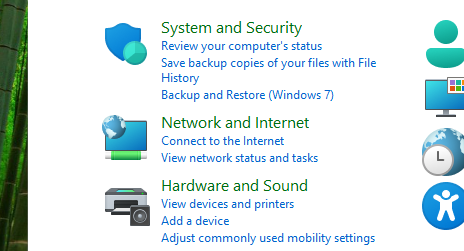

4. Öffnen Sie **Network and Sharing Center**:  
   

5. Klicken Sie links auf **Change Adapter Settings**:  
   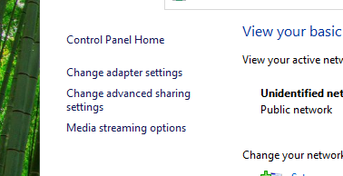

6. Finden Sie Ihren primären Netzwerkadapter.  
   In unserem Fall gibt es nur einen Adapter:  
   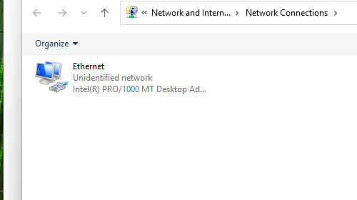

7. Klicken Sie mit der rechten Maustaste auf den Adapter und wählen Sie **Properties**:  
   

8. Wählen Sie **Internet Protocol Version 4 (TCP/IPv4)** aus und klicken Sie auf **Properties**:  
   

9. Stellen Sie sicher, dass **Obtain an IP address automatically** ausgewählt ist. Aktivieren Sie auch die automatische DNS-Auswahl:  
   

10. Klicken Sie auf **OK**.

---

### Testen

#### Server-Seite

1. Starten Sie den Windows-Server.

2. Überprüfen Sie, ob der DHCP-Dienst läuft:  
   - Öffnen Sie die Diensteverwaltung (`services.msc`) und stellen Sie sicher, dass der DHCP-Server-Dienst aktiv ist:  
     

3. Öffnen Sie den Server-Manager:  
   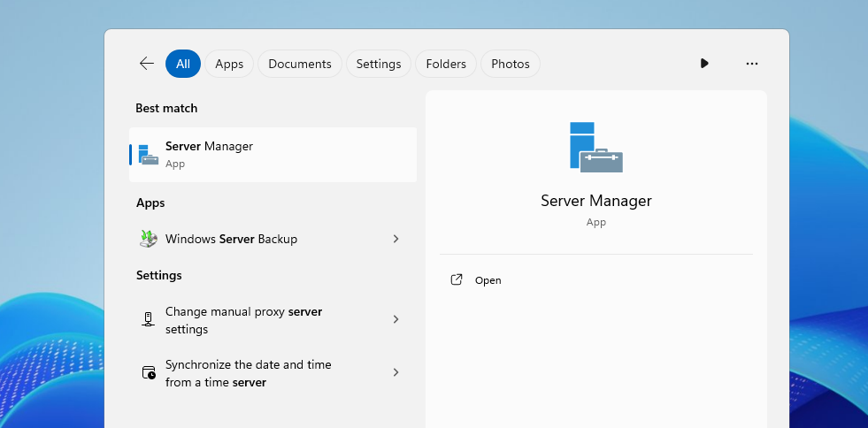

4. Navigieren Sie zu den **DHCP-Tools**:  
   

5. Überprüfen Sie die vergebenen Scopes:  
   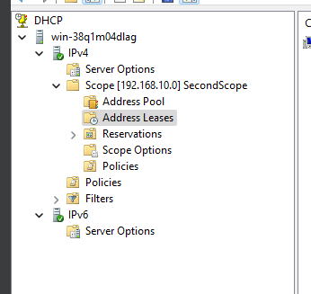

Hier sollte der Client aufgelistet sein.

#### Client-Seite

1. Starten Sie den Client.

2. Öffnen Sie die Eingabeaufforderung und führen Sie `ipconfig /renew` aus:  
   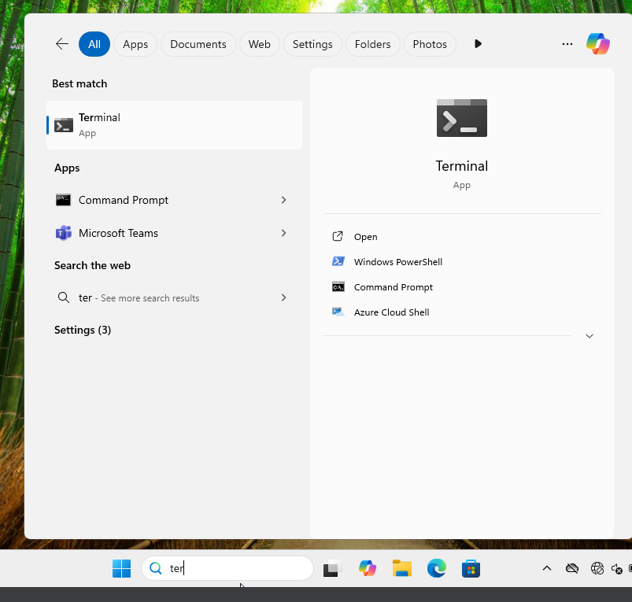

3. Überprüfen Sie die IP-Konfiguration mit `ipconfig`. Der Client sollte eine IP-Adresse aus dem definierten Bereich erhalten haben:  
   
