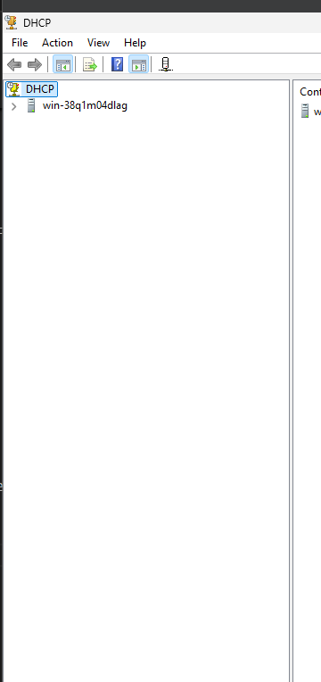

## Aftter installon configurations
### Static Ip config
DONE dont do it again
### Time Zone Config
Von der main menu
1. Drucken sie auf das Local server icon

2. Dann von die server Properties musst du rechs horisonal scrollen bis du die "Time Zone" Einstellung seihst

Es solle so aussehen wenn du der gefunden hast

3. Drucken sie auf das text der Time zone so das du der anderen kannst

4. Druck auf "change Time and Date"

Wahlen sie ihre momentate Zite Zone.
das ist fur uns wichtig so das wir einige nicht oftter auftauchender problremen mit der verbindung des zite zu vermeiden

## DHCP post install configuration

Jetz wenn sie auf das main menu windows sidn konnt ihr sehen auf das oberere rechte rand des bild schirms eine gelbe warn dreieck

1. Drucke auf das Flagge mit der gelbe drie eck

2. Dann Druck auf das "Complete DHCP Configualatio"

3. Dann Werden wir mit der erklarungs windows gezeigt, wir konnen das durch lessen und dann Auf "Commit" Druken

Auch was intereatstit ist. Wenn du der server ohne AD installiertst. Wir der DHCP Server die Momentate Konto nehmen fur das Administartor konto. Ware das unter eine AD, Wurde es so aussehen
* 
Das wirds du warscheinlich antreffen, Wenn du weiter mit Windwos Server Arbeittest, wio dann die configuration von die usern in der AD acuh notigeware.
Aber das ist fur den moment irelevant.

Jetz haben wir das Installation und post Configuration des DCHP Modul Abgeschlossen

## DCHP ranges
Configuraiton Des DCHP Server

### Theorie
Bevor wir in der DCHP Range Rein Gehen Mussen wir auch ein bischen Theor machen.
Es ist Nicht Nottig aber es hilft sehr viel wenn du es besser vershen willst.

#### **Was sind DCHP Rangens**
DHCP-Range Erklärung  

Die **DHCP-Range** ist der Bereich von IP-Adressen, die ein **DHCP-Server** (Dynamic Host Configuration Protocol) automatisch an Geräte in einem Netzwerk vergeben kann.  

##### Kernpunkte:  
1. **Zweck**:  
   DHCP erleichtert die IP-Adresszuweisung, indem es Geräten automatisch Adressen zuweist, anstatt diese manuell zu konfigurieren.  

2. **Range-Definition**:  
   - Die **Range** legt fest, welche IP-Adressen zur automatischen Vergabe verfügbar sind.  
   - Beispiel: Range von `192.168.1.100` bis `192.168.1.200` – nur diese Adressen werden vom DHCP-Server vergeben.

3. **Einstellungen**:  
   - Werden im Router oder Server konfiguriert.  
   - Außerhalb der Range können **statische IP-Adressen** vergeben werden (z. B. für Drucker oder Server).  

4. **Zusätzliche Parameter**:  
   Neben der IP-Adresse verteilt der DHCP-Server oft auch Informationen wie Subnetzmaske, Gateway und DNS-Server.

##### Vorteil:  
Es automatisiert die Netzwerkkonfiguration und minimiert Fehler bei der manuellen Eingabe.

---
**Die Ip Ranges Rein setzen**

Um die Ip ranges rein zu setzen mussen wir kurz eine IT Theorie machen.
Das ist simpel. Wir mussn die Untershciede Zwischen IPv4 Und IPv6, wissen.

------
------

#### **Erklärung zu IPv4 und IPv6**  

**IPv4** und **IPv6** sind Protokolle zur Adressierung von Geräten in einem Netzwerk, wie Computern, Smartphones oder Servern. Sie sorgen dafür, dass Datenpakete an die richtigen Geräte gesendet werden.  

---

##### IPv4 (Internet Protocol Version 4)  

1. **Adressformat**:  
   - IPv4-Adressen bestehen aus **32 Bit**, dargestellt als vier Zahlen (0-255), getrennt durch Punkte.  
   - Beispiel: `192.168.1.1`

2. **Kapazität**:  
   - Maximal **4,3 Milliarden Adressen**.  
   - Wegen des Wachstums des Internets und der begrenzten Adressanzahl wird der Platz knapp.

3. **Merkmale**:  
   - Weit verbreitet und einfach einzusetzen.  
   - Unterstützt Broadcast (Nachrichten an alle Geräte im Netzwerk).  
   - Unterstützt keine eingebauten Sicherheitsfunktionen wie Verschlüsselung.

---

##### IPv6 (Internet Protocol Version 6)  

1. **Adressformat**:  
   - IPv6-Adressen bestehen aus **128 Bit**, dargestellt als acht Gruppen von Hexadezimalzahlen, getrennt durch Doppelpunkte.  
   - Beispiel: `2001:0db8:85a3:0000:0000:8a2e:0370:7334`  

2. **Kapazität**:  
   - Theoretisch **340 Sextillionen Adressen** – genug für jedes Gerät weltweit.  

3. **Merkmale**:  
   - Integrierte Sicherheitsfunktionen, z. B. IPsec (für Verschlüsselung).  
   - Effizientere Datenweiterleitung (kein Broadcast, sondern Multicast).  
   - Unterstützt automatische Adresskonfiguration.  

---

##### Unterschiede zwischen IPv4 und IPv6  

| **Eigenschaft**        | **IPv4**                  | **IPv6**                  |
|------------------------|---------------------------|---------------------------|
| **Adresslänge**        | 32 Bit                   | 128 Bit                  |
| **Adressformat**       | Dezimal (z. B. 192.0.2.1) | Hexadezimal (z. B. 2001:db8::1) |
| **Adressanzahl**       | 4,3 Milliarden           | 340 Sextillionen         |
| **Sicherheit**         | Extern (z. B. Firewalls) | Integriert (IPsec)       |
| **Kompatibilität**     | Veraltet, aber weit verbreitet | Modern, noch im Aufbau   |

---

##### Zusammenfassung  
- **IPv4** ist das ältere, aktuell noch weit verbreitete Protokoll, aber wegen Adressknappheit zunehmend limitiert.  
- **IPv6** ist moderner, leistungsfähiger und zukunftssicher, aber noch nicht flächendeckend eingeführt.  

### **Erklärung zu Static IPs**  

Eine **statische IP-Adresse** (Static IP) ist eine feste, manuell konfigurierte IP-Adresse, die einem Gerät im Netzwerk dauerhaft zugewiesen wird. Im Gegensatz zu einer dynamischen IP-Adresse, die automatisch von einem DHCP-Server vergeben wird, bleibt eine statische IP unverändert.

---
---

#### **Eigenschaften einer Static IP**  

1. **Dauerhaftigkeit**:  
   - Die IP-Adresse ändert sich nicht, auch nach einem Neustart des Geräts oder Routers.  
   - Beispiel: Ein Server hat dauerhaft die IP-Adresse `192.168.1.10`.  

2. **Manuelle Konfiguration**:  
   - Die Zuweisung erfolgt durch einen Administrator, entweder im Gerät selbst oder im Netzwerkrouter.

3. **Individuelle Einstellungen**:  
   - Neben der IP-Adresse müssen auch Subnetzmaske, Gateway und DNS-Server manuell konfiguriert werden.  

---

#### **Vorteile von Static IPs**  

1. **Einfacher Zugriff auf Geräte**:  
   - Perfekt für Geräte, die leicht auffindbar sein müssen, z. B. Server, Drucker, Überwachungskameras.  
   - Beispiel: Ein Webserver ist unter einer festen IP erreichbar, was für Domains und Remote-Zugriffe wichtig ist.

2. **Stabilität**:  
   - Verhindert Probleme bei Diensten, die von einer festen IP abhängen (z. B. Portweiterleitungen oder VPNs).  

3. **Netzwerkmanagement**:  
   - Erleichtert die Fehlersuche und Überwachung im Netzwerk.  

---

#### **Nachteile von Static IPs**  

1. **Aufwändige Verwaltung**:  
   - Jede Änderung muss manuell vorgenommen werden, was bei großen Netzwerken zeitintensiv ist.  

2. **Fehleranfälligkeit**:  
   - Falsche Konfigurationen können Konflikte (z. B. doppelte IP-Adressen) verursachen.  

3. **Sicherheitsrisiken**:  
   - Static IPs sind leichter von Hackern angreifbar, da ihre Adressen bekannt und vorhersehbar sind.  

---

#### **Einsatzgebiete von Static IPs**  

1. **Server**: Web-, Mail- und Datenbankserver benötigen feste Adressen für eine konstante Erreichbarkeit.  
2. **Drucker und NAS**: Geräte in lokalen Netzwerken, die von mehreren Nutzern verwendet werden.  
3. **Fernzugriff**: Für Geräte, die über das Internet oder ein VPN erreichbar sein müssen.  
4. **IoT-Geräte**: Smarte Geräte, die spezifische Netzwerkeinstellungen benötigen.  

---

#### **Zusammenfassung**  
Static IPs sind ideal für Geräte, die stabil und konsistent erreichbar sein müssen, 
erfordern aber mehr Verwaltungsaufwand und bergen potenzielle Sicherheitsrisiken. 
Sie bieten Stabilität und Zuverlässigkeit, sind jedoch nicht für jedes Gerät notwendig.

---
---

### Configuration
heir Werden Wir die Ranges selber auswahlen in das IPV4 Format und dann nach aktialiseiren.
#### Menus
Um in der Configuraiton Menu Rein Zu kommen an der Server Mussen wir:
In der Obberen Rechte Ecke. 
1. Drucken Wir Auf Tools

2. Unter Tools Drucken Wir auf "DCHP"

Jetz Sind Wir erfolgreich in der Configuration Menu reingekommen.
Es Sollte so aussehen:

Auf das Linke Seiten Menu

3. Drucken Wir auf der Belibige Server Die wir konfigurieren Wollen

In unserem Fall einfach auf das Erste Server drucken.

4.  Jetz Wahlen wir der IPv4 Teil Des DHCP Server

5. Dann wird eine listo von options gezeigt, aber wir drucken mit der rechte maus taste weider auf das IPv4 icon

6. Dann Auf New Scope

Es Wird dir eine Wizzerd Raus geben fur Das weiter configuration des Ranges

#### Ranges Rein setzen

1. Wir mussen unsere Scope Eine name geben die Uns Hilft die zu unterschieden

Nach Dem wir die Name des scopes geben, Mussen wir in unsere IP Plan Scahun so das wir eine Passende Range fur unsere
Server geben konnen. Wir Wollen Unsere Netzwerk gut aufteilen so das:
* Alle gerate eine Plat haben
* Keine Konflikte In der aufteilung von Ip Adressen, Und;
* Expansion des Anzahl an geraten in der zufkunft

2. Mit der Nutzen Des IP Plans Fuhlen sie ihren IP Scopes. Dann Druchen sie Next

3. 
An der Nachste Seite, sind Die Static Ip's
4. Schribe die IP Range Rein
5. Drucke auf add.
6. Und dann auf Next

and Der Nachster Seite befindent sich die leasing. Da wird die Zeit Bestimmt wie lang die fur eine Gerat frie Gelassen wird
7. Wir wahlen der Stander aus, und Drucken Next

8. Kurze Frage ob Du die Einstellungen Willst, Next Drucken

9. An der Anderen Slide ist Der Defulat Gateway. Unsere ist 10.0.0.254

10. Drucke auf and und dann auf Next
11. Dns Server Configuraiton, Wir haben keine deswegen Next

12. Win server Configuraiton, wir haben das auch nicht. deswegen Einfach next Drucken

13. Einfach die Default Auswahlen und next Drucken
14. Und das ist der Finish windwos.

Wir Musen Noch der Server Neu Starten

15. Mit der rehcte Maustaste druke auf das Haupt DCHP sever.

16. Dann Auf All Tasks, und Retart

Warte eine Moment

Wenn wir der DCHP server Configuruat haben sollte es in der Files angezeigt werden.
Und da konnen wir der Auch manngen

### Kurze Bemerkung 
Ich habe eine fehlher gemacht in der auswahl an ip addressen.
Ich habe eine falsche range ausgwahlt und auch vergessen eine Static IP zu setzen.
Benniger fehler. Ich habe die in retrospect koregiret, aber ich habe keine zusatzliche dokumentaiton gemahct, wegen viels von was ich gemacht habe war trubelshooting und auch viele netwrok videos an schauen raus zu finden was einzele Virtualbox Networks beduetung.
nach das habe ich rausgefunden was es ware am einfachsten mit eine Internal Network, Wegen es gibt eine direkte verbindug zwischen die 2 VM's. 

Aber ich will das die Richtig im Netzverbunden sind, mit eine internet Verbindung

### Client Configuration
So das unsere cleint eine DCHP von uns auswahlt mussen wir uberprufen das der cleint pc eine Automatische DHCP adresses sucht.
Per default an windwos ist das als Automatish angeschaltten, Und bei eine frischen windows install mussen wir keine sorgen machen. Aber wir zeige wie mann das macht

1. Starte die Cleint Windowsn
2. Scuhe in der Such bar "Control Pannel"

3. Unter Control Pannel geht man auf "Network and Internet"

4. Dann Auf Network und sharing

5. Auf das linke seite, Druckt man auf "Change Adapter setting"

6. Sucht man seiner primary adapter, unsere fall haben wir nur eine.

7. Mit der rechte maus taste druckt man auf das adapter

8. geht auf Properties
9. Geht auf das "Internet Protocal Version 4(TCP/IPv4)"

10. Und selectiet die Die option beim IP adreses "Optain Ip adress automaticly"

* epfolen auch das man die DNS automatisch an nimmt
11. Druckt OK.

# Testen

## Server Side

1. Starten Sie die Windows Server.  

2. Stellen Sie sicher, dass der DHCP-Dienst auf dem Windows Server ausgeführt wird:  
- Öffnen Sie „Dienste“ (führen Sie `services.msc` aus) und überprüfen Sie, ob der DHCP-Server-Dienst gestartet wurde.  

3. Gehe Auf das Server manger

4. Dann auf DCHP Tools.

5. Dann Drucken sie auf das lessed Scopes.

6. Heir sollte ihren Cleint Stehehn. 

Sie konnen mit der Mac Adresse uberprufen, aber das ist bishcehn over kill

## Cleint Side
1. Starten sie der Cleint 

2. Öffnen Sie eine Eingabeaufforderung und führen Sie `ipconfig /renew` aus.
  

3. Überprüfen Sie die IP-Konfiguration mit `ipconfig`. Der Client sollte eine IP-Adresse aus dem definierten Bereich des DHCP-Servers erhalten haben.(Sehe Im Ip plan fur das range)
